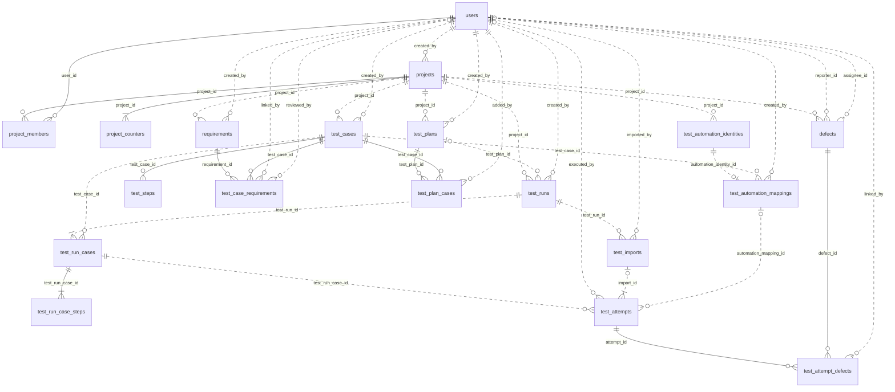

# QATrack V1 领域模型

日期：2026-09-06。状态：**QATrack V1 Domain Model Freeze v1.0**。已完成 MySQL 8.0.46 DDL 与测试数据落地验证，尚无 Java/前端业务实现。
数据库采用本轮明确指定的 MySQL 8.0.46。完整字段、默认值、约束及索引见 [数据库设计草案](DATABASE-DESIGN-DRAFT.md)。

已确认的产品选择（本轮补充已纳入）：

- 同一 Run 内保留每次尝试，FAIL 后再 PASS 不覆盖原记录。
- JUnit 未映射项先人工映射，再原子导入；不擅自新建正式用例。
- 当前 Test Case 可继续编辑；执行必须保存当时的内容及步骤快照。
- Run 不强制绑定 Plan，test_plan_id 可空；Ad-hoc 和 JUnit/CI Import 可以无计划。
- 用户、项目和项目成员管理集中于平台 ADMIN；普通 USER 经成员关系获得 TESTER/DEVELOPER 身份，暂不引入 PROJECT_ADMIN。
- Attempt 增加 SKIPPED，独立于 BLOCKED；NOT_RUN 只表示尚无任何 Attempt。
- 采用 test_run_cases / test_run_case_steps / test_attempts 命名，并拆分自动化身份绑定，支持一个逻辑用例多个实现。

最终冻结采用 Run 自身非空 project_id 与可空 test_plan_id，移除独立 test_run_projects；保留 Identity/Mapping 拆分。七维取舍见 [冻结决策](DOMAIN-FREEZE-v1.0.md)，实际执行证据见 [数据库验证](DATABASE-VALIDATION-v1.0.md)。

## 1. V1 领域边界总结

V1 管理一个项目内从需求、用例、计划、执行、结果到缺陷的质量链路，提供覆盖分析和质量指标。
包含登录/项目成员权限、手工测试、多批次 JUnit XML 结果导入，以及需人工确认的 AI 候选用例生成。
系统管理区负责用户和项目管理；QA 工作区负责需求、用例、计划、执行、缺陷及 Dashboard。

本次已落地数据库结构与测试数据。V1 不做完整需求/用例版本库、自动变更影响分析、微服务、多租户平台、复杂 RBAC/SSO、测试执行引擎、CI 调度或完整 Jira 替代。
JUnit 是导入既有测试结果；AI 是生成候选而非直接写正式数据，不引入工作流引擎。

### 1.1 用户权限与项目角色

| 位置 | 推荐字段与值 | 作用 |
| --- | --- | --- |
| users | system_role = ADMIN / USER | ADMIN 是平台管理员；USER 是普通身份分类 |
| project_members | project_role = TESTER / DEVELOPER | 每项目每用户一个业务角色，不同项目可不同 |
| project_members | status = ACTIVE / INACTIVE | 停止未来访问，不破坏历史执行者引用 |

ADMIN、TESTER、DEVELOPER 的能力都保留，但 ADMIN 放在系统层，TESTER/DEVELOPER 放在成员关系。
不需要 roles 或 user_roles：V1 没有自定义角色、多角色叠加或动态权限编辑的需求。

| 操作 | ADMIN | 项目 TESTER | 项目 DEVELOPER |
| --- | --- | --- | --- |
| 用户、项目及成员管理 | 全局允许 | 否 | 否 |
| 读取项目质量数据 | 全局允许 | ACTIVE 成员可读所属项目，归档项目只读 | ACTIVE 成员可读所属项目，归档项目只读 |
| 需求/用例/计划、Run、JUnit 导入、AI 确认保存 | 允许 | 允许 | 否 |
| 报告缺陷、查看相关证据 | 允许 | 允许 | 允许 |
| 指派/重开缺陷、复核后关闭 | 允许 | 允许 | 否 |
| 处理为 IN_PROGRESS / RESOLVED | 允许 | 否 | 自己负责的缺陷 |

以上 ADMIN 集中管理和项目成员单角色规则已由用户确认；V1 不设置 PROJECT_ADMIN。
所有权限在 Service 检查，DAO 不信任前端传入的 user_id；用户 DISABLED 时即使仍在 session 中也不能操作。
Session 使用容器机制，本阶段不为其新增数据库表。用户创建由 ADMIN 负责，新用户默认 USER；普通用户不能自行修改 system_role。

## 2. 核心实体列表

| 领域对象 | 类别 | 为什么存在 |
| --- | --- | --- |
| User | 核心 | 登录身份及稳定的审计主体 |
| Project | 核心 | 隔离质量数据和成员权限 |
| ProjectMembership | 关联 | 表达同一人在 A 项目是 TESTER、B 项目是 DEVELOPER |
| ProjectCounter | 编号基础数据 | 为项目内业务编号提供并发安全分配 |
| Requirement | 核心 | 当前需求内容及优先级 |
| TestCase / TestStep | 核心 / 从属 | 当前可维护用例及结构化有序步骤 |
| RequirementTestCaseLink | 关联 | N:M 覆盖关系、复核与移除状态 |
| TestPlan / PlanCase | 核心 / 关联 | 表达可复用测试范围 |
| TestRun | 核心 | 一次具体执行上下文，project_id 必填，可不来自 Plan，可有多次重测/导入 |
| AutomationIdentity | 外部身份 | 在项目内唯一标识 source/namespace/external_key |
| AutomationMapping | 关联 | 把外部身份绑定到一个逻辑 Case，Case 可有多个绑定 |
| TestRunCase | 核心执行项 | 唯一 Run×Case，承载执行内容快照和当前结果入口 |
| TestRunCaseStep | 执行证据从属 | 固定当时每一步 action/expected result |
| TestAttempt | 核心证据 | 每次不可变 PASS/FAIL/BLOCKED/SKIPPED 尝试 |
| Defect | 核心 | 可独立存在并影响多个执行结果的缺陷 |
| AttemptDefectLink | 关联 | 将缺陷追踪到具体失败证据 |
| TestImport | 导入事件 | 一个原子批次的来源、摘要、操作者和幂等记录 |

AI 候选在本轮模型中不是新的长期业务实体。生成结果在有期限的用户会话/预览上下文中审阅，
只有用户明确接受的候选才创建 TestCase/TestStep 和需求关联；不要求跨会话保留被拒绝候选。

## 3. 领域关系图

图与独立 [V1-ER.mmd](V1-ER.mmd) 内容相同，展示全部 19 表、40 条 FK，包含 created_by/reporter/assignee 等用户引用；边标签为子表 FK 字段名。
端点符号表示基数：|| 恰一、o| 零或一、o{ 零到多、|{ 一到多；实线表示该 FK 属于子表 PK，虚线表示非标识关系，不用线型表达是否可空。
Run.project_id 的 NOT NULL/FK 已保证必有项目归属；每项目四类 Counter、Run 非空清单、非空快照步骤和成功批次至少一个 Attempt 仍包含 Service 保证的最少子行数。
人工尝试可没有批次/映射；自动化尝试可没有人工执行者。逐条可空性、引用动作与索引支持见 [数据库设计](DATABASE-DESIGN-DRAFT.md)；完整字段定义以数据库草案第 2 节为准。

- User ↔ Project、Requirement ↔ TestCase、TestPlan ↔ TestCase 均为 N:M，通过关联表实现。
- Project → Run 为 1:N，每个 Run 必须属于一个存在的 Project；Plan → Run 为 1:N，每个 Run 可有 0 或 1 个来源 Plan。
- Case → AutomationMapping 为 1:N，外部身份 → Mapping 为 1:0..1；一个身份不同时属于多个 Case。
- Run → TestRunCase 为 1:N；TestCase → TestRunCase 为 1:N。
- 一个 Run 的同一 TestCase 只有一个 TestRunCase，UNIQUE(run_id,case_id) 约束这个事实。
- TestRunCase 与头部内容快照是概念上的 1:1，放在同一行；快照步骤为 1:N，不另建空壳 1:1 表。
- TestRunCase → Attempt 为 1:N（允许暂时 0 次）；每个执行项的“当前尝试”最多一个，是查询结果而非独立关系表。
- RunCase ↔ Defect 的业务关系为 N:M，实际通过 Attempt ↔ Defect 的 N:M 固定失败证据。不能把两者简化成 1:1。

## 4. 冻结的 V1 表清单

共 19 表、154 字段、19 PK、40 FK、13 UNIQUE、51 CHECK；24 普通索引，非 PK 索引共 37 个。与真实 DDL 的对照见数据库设计及实测报告。

| Table | 用途 / 关键字段 | PK | FK 目标 | 额外 UNIQUE |
| --- | --- | --- | --- | --- |
| `users` | 核心：登录身份及平台管理权限；角色业务范围由项目成员决定。 `id`、`username`、`display_name`、`password_hash`、`system_role` | `id` | 无 | (username) |
| `projects` | 核心：质量数据边界；保存项目标识与归档状态。 `id`、`project_key`、`name`、`description`、`status` | `id` | users | (project_key) |
| `project_members` | 关联：User 与 Project 的 N:M 关系，每个成员在一个项目只有一个角色。 `project_id`、`user_id`、`project_role`、`status`、`joined_at` | `project_id,user_id` | projects, users | 无 |
| `project_counters` | 基础关联：项目与编号种类的计数器，安全分配业务序号。 `project_id`、`entity_type`、`next_value` | `project_id,entity_type` | projects | 无 |
| `requirements` | 核心：当前需求定义。 `id`、`project_id`、`key_no`、`title`、`description` | `id` | projects, users | (project_id,key_no) |
| `test_cases` | 核心：当前可编辑用例定义，步骤单独规范化；执行采用独立快照。 `id`、`project_id`、`key_no`、`title`、`description` | `id` | projects, users | (project_id,key_no) |
| `test_automation_identities` | 外部身份：在一个项目内唯一标识某来源域的一项自动化实现；不存逻辑用例 FK。 `id`、`project_id`、`source`、`namespace`、`external_key` | `id` | projects | (project_id,source,namespace,external_key) |
| `test_automation_mappings` | 身份绑定：一个逻辑 TestCase 可绑定多个外部实现；每个外部身份在 V1 至多绑定一个逻辑用例。 `id`、`automation_identity_id`、`test_case_id`、`status`、`created_by` | `id` | test_automation_identities, test_cases, users | (automation_identity_id) |
| `test_steps` | 从属：当前用例的有序步骤，支持逐步编辑和重排。 `test_case_id`、`step_order`、`action`、`expected_result` | `test_case_id,step_order` | test_cases | 无 |
| `test_case_requirements` | 关联：需求和用例 N:M，记录当前复核状态并保留已移除关系的存在证据。 `requirement_id`、`test_case_id`、`status`、`linked_by`、`linked_at` | `requirement_id,test_case_id` | requirements, test_cases, users | 无 |
| `test_plans` | 核心：可复用测试范围，一个计划可创建多个 Run。 `id`、`project_id`、`key_no`、`name`、`description` | `id` | projects, users | (project_id,key_no) |
| `test_plan_cases` | 关联：计划和当前用例 N:M；只表达当前计划范围。 `test_plan_id`、`test_case_id`、`added_by`、`added_at` | `test_plan_id,test_case_id` | test_plans, test_cases, users | 无 |
| `test_runs` | 核心：一次执行；project_id 必填，test_plan_id 可空。 `id`、`project_id`、`test_plan_id`、`name`、`environment` | `id` | projects, test_plans, users | 无 |
| `test_run_cases` | 核心执行项：唯一 Run×Case，保存该 Run 采纳的用例内容快照；当前状态由尝试推导。 `id`、`test_run_id`、`test_case_id`、`snapshot_title`、`snapshot_description` | `id` | test_runs, test_cases | (test_run_id,test_case_id) |
| `test_run_case_steps` | 执行证据从属：Run 中某执行项的有序步骤快照，和当前 test_steps 独立。 `test_run_case_id`、`step_order`、`action`、`expected_result` | `test_run_case_id,step_order` | test_run_cases | 无 |
| `test_imports` | 基础事件：一次成功 JUnit 导入批次，提供上传者、来源证据与幂等性。 `id`、`test_run_id`、`request_key`、`report_sha256`、`source_namespace` | `id` | test_runs, users | (request_key) |
| `test_attempts` | 核心结果事实：执行项的每次不可变尝试，可为 PASS/FAIL/BLOCKED/SKIPPED；NOT_RUN 不入表。 `id`、`test_run_case_id`、`attempt_no`、`status`、`executed_by` | `id` | test_run_cases, users, test_imports, test_automation_mappings | (test_run_case_id,attempt_no); (submission_key); (import_id,test_run_case_id) |
| `defects` | 核心：独立项目缺陷；可以手工报告，也可以关联一个或多个失败尝试。 `id`、`project_id`、`key_no`、`title`、`description` | `id` | projects, users | (project_id,key_no) |
| `test_attempt_defects` | 关联：失败尝试与缺陷 N:M，让缺陷证据固定到实际 FAIL 记录。 `attempt_id`、`defect_id`、`linked_by`、`linked_at` | `attempt_id,defect_id` | test_attempts, defects, users | 无 |

## 5. 关键状态模型

| 对象 | 状态及主要转换 | 限制 |
| --- | --- | --- |
| User / Membership | ACTIVE ↔ DISABLED / ACTIVE ↔ INACTIVE | 禁用/离开不删历史主体 |
| Project | ACTIVE ↔ ARCHIVED | 归档前所有 Run 已终结；归档后只读，ADMIN 可恢复 |
| Requirement | DRAFT → ACTIVE；ACTIVE → DRAFT；DRAFT/ACTIVE → ARCHIVED | 归档终态；编辑内容使相关覆盖关系待复核 |
| TestCase | DRAFT → READY；READY → DRAFT；DRAFT/READY → ARCHIVED | READY 至少一步；内容编辑和退回 DRAFT 同事务，旧快照不变 |
| TestPlan | DRAFT → READY；READY → DRAFT；DRAFT/READY → ARCHIVED | 发布时非空，创建 Run 时再校验全部成员 READY |
| TestRun | IN_PROGRESS → COMPLETED 或 CANCELLED | 两种终态均不 reopen；再次执行新建 Run |
| RunCase 的 Current Outcome | 无尝试=NOT_RUN；有尝试=最后一次的 PASS/FAIL/BLOCKED/SKIPPED | 五种状态通过查询计算，不在父行保存第二份 |
| Attempt | 插入时 PASS / FAIL / BLOCKED / SKIPPED | 提交后不改状态；新尝试可与上次不同 |
| Defect | OPEN → IN_PROGRESS → RESOLVED → CLOSED；RESOLVED/CLOSED → REOPENED → IN_PROGRESS | 状态规则在 Service；更改要检查 lock_version 和角色 |
| RequirementTestCaseLink | NEEDS_REVIEW ↔ CONFIRMED；任意有效态 → REMOVED；REMOVED → NEEDS_REVIEW | 重新关联复用行，复核时验证双方最新内容 |

缺陷的 priority 表示处理顺序，severity 表示影响程度，两者可不同。
V1 不增加十几个缺陷状态；无效/不修复问题也需要负责人在 resolution_note 说明，然后由 TESTER/ADMIN 复核关闭。
不保留完整缺陷状态变更日志，这是 V1 边界；执行尝试历史则是必须保留的核心证据。

## 6. 关键业务规则

### 6.1 Plan、Ad-hoc Run、快照与重测

Run 是独立执行活动，test_runs.project_id 为 NOT NULL 且 FK 引用 Project；test_plan_id 允许 NULL。两者创建后均不可迁移；非空 Plan 必须与 Run 同项目。

| 创建方式 | 项目与计划 | 初始范围 |
| --- | --- | --- |
| Plan Run | 必选项目和 READY Plan，二者同项目 | 从计划当前 READY 用例冻结清单 |
| Ad-hoc Run | 必选项目，Plan 为空 | 用户明确选择本项目非空 READY 用例集合 |
| JUnit/CI 新 Run | 必选项目，Plan 可空 | 无 Plan 时取人工确认映射后的非空逻辑用例集合；有 Plan 时使用计划全清单 |

Run（含非空 project_id）、全部 RunCase 和快照步骤在一个事务中创建。任何部分失败全部回滚；数据库会直接拒绝项目为 NULL 或不存在的 Run。
报告中的未映射项先处理完再创建无计划 Run；零项报告、非 READY 用例、跨项目或多个实现碰撞均拒绝。

RunCase = 某 Run 中一个逻辑用例的执行项及内容快照，UNIQUE(test_run_id,test_case_id)。
Attempt = 一次实际结果事实；对外的当前结果按最新 Attempt 查询，不单独持久化。
快照保存当时标题、描述、前置条件、优先级及逐步 action/expected_result，业务编号与稳定 Case 身份仍引用当前实体。
Run 创建后范围和快照不改；编辑 Plan/Case 只影响后续 Run。要增加用例或采用编辑后的定义，新建 Run。
同 Run 重测继续使用本快照；Case 当前定义可继续编辑。V1 不逐步骤记录 PASS/FAIL，结果粒度仍为整个逻辑用例。

例：Run 10 / TC-003 的三步快照，Attempt 1=FAIL 且关联 BUG-007，Attempt 2=PASS。
当前统计为一个 PASS，失败证据和缺陷关联保留。当前用例改成四步也不改 Run 10；新 Run 11 才采纳四步。

### 6.2 完成、取消与当前结果

- COMPLETED 要求执行项数量 > 0，且每一项至少有一次尝试；允许最终 FAIL/BLOCKED/SKIPPED，因此完成表示所有执行项已有处置结果，不代表全部实际执行或通过。全 SKIPPED 的 Run 可以完成，但实际执行数为 0。
- 完成检查与提交尝试都锁住同一 Run，防止检查后有人改变结果。COMPLETED/CANCELLED 后拒绝新尝试和导入。
- attempt_no 表示被系统接受的顺序，不按 executed_at 排序；补录旧报告可能有更早时间，UI 需警示并让用户显式确认追加。
- 误填结果在 IN_PROGRESS Run 内以带更正说明的新尝试纠正；终态 Run 的错误报告新建更正 Run，不静默改旧证据。

### 6.3 Coverage 与 Dashboard

对指定项目的 ACTIVE Requirement：

- **无任何用例**：不存在非 REMOVED 关联（不论用例是否 READY）。
- **无有效覆盖**：不存在 CONFIRMED 且用例 READY 的关联；这与“无任何用例”不是一个列表。
- Requirement Coverage = 有有效覆盖的 ACTIVE 需求数 / ACTIVE 需求总数 × 100%。一需求多条关联只计一次。
- 分母为 0 显示 N/A；同时展示 ACTIVE、DRAFT、ARCHIVED 计数，不能通过隐藏分母制造误导。
- Requirement 或当前 TestCase 的语义内容变化时，相关 CONFIRMED 关系统一改 NEEDS_REVIEW。只有人工复核后才恢复覆盖。
- 这只是保守的关系复核标记，不实现 diff、版本历史、自动影响分析或智能 stale 判定。Coverage 也不证明测试已经执行或需求已经通过。

Run 指标按每个 RunCase 的最新 Attempt 计算。N=执行项总数；P/F/B/S 分别为 PASS/FAIL/BLOCKED/SKIPPED 数量。
有记录项 R=P+F+B+S，NOT_RUN=N−R；实际执行数=P+F；Pass Rate=P/(P+F)，分母 0 为 N/A。
BLOCKED 与 SKIPPED 分列，不进入实际执行数或通过率分母。记录完成率=R/N，实际执行率=(P+F)/N；N=0 时 N/A。
不把多次 Attempt 当多个执行项，也不把 SKIPPED 当未收到结果。例：P=1、B=1、S=1、NOT_RUN=1，则记录完成率75%、实际执行率25%、通过率100%，Run 仍未完成。
此口径替换上一稿把 BLOCKED 计入执行数的定义，Dashboard/API/报告必须使用同一口径。
项目 Dashboard 的执行指标必须选择一个 Run，或按 Run 分组展示；不把不同 Run 的同一用例混加成项目唯一用例数。
Open Defects 定义为尚未解决的 OPEN/IN_PROGRESS/REOPENED；另列 RESOLVED 待验证和 CLOSED，Critical/High 使用相同状态口径。

### 6.4 JUnit/CI 导入与一对多自动化映射

本次采用独立 test_automation_mappings，删除 test_cases 上的单值 automation_key。
Case 可有 0..N 个映射（例如同一逻辑行为的不同平台实现）；没有映射也可手工测试，不存互斥的手工/自动化类型。

外部身份放在 test_automation_identities，候选键为 (project_id,source,namespace,external_key)。
绑定表保存 automation_identity_id → test_case_id，身份侧 UNIQUE、Case 侧非唯一。
身份和绑定拆开可以同时维持项目内唯一性与 3NF：不能把由 Case 决定的 project_id 再冗余放进绑定表。
这两表不是测试执行框架或 CI 调度系统；V1 source 仅 JUNIT，未来新增来源时再扩展合法值。

namespace 是模块/套件稳定来源域；external_key 是单个实现的 classname/name 规范身份（格式版本及 UTF-8 字节长度前缀编码），不再在键内重复编码项目或 namespace。
精确区分大小写，不截断，不按标题猜测。空名、超长键、重复报告项、映射歧义全部拒绝。
未知身份只在预览中展示，用户先将其绑定到已有 Case；身份与绑定在独立的短事务中原子保存后，重新预览再导入。
被 Attempt 引用后的身份和绑定目标不可变，停用仍保留证据；未使用的绑定可以在版本/锁检查下纠正 Case。

导入流程：上传 → 限量安全解析 → 预览身份/映射/范围 → 人工补齐映射 → 再验证 → 原子导入。
禁用 DTD/外部实体、限制文件/节点/失败信息大小；解析在事务外，具体限额在 API 阶段确定。

- JUnit 正常项→PASS，failure/error→FAIL，skipped→SKIPPED，跳过原因存 comment；BLOCKED 留给无法继续执行的阻塞事实。
- NOT_RUN 仅表示某 RunCase 尚无 Attempt，不能从 XML skipped 生成 NOT_RUN。
- 新 Run 必选项目，Plan 可空；空 Plan 时按确认的 Case 清单冻结范围/快照，有 Plan 时冻结整个计划并让未报告项维持 NOT_RUN。
- 导入已有 IN_PROGRESS Run 时只能追加到已有执行项；范围外项拒绝，不能利用无计划模式偷偷扩容既有 Run。
- test_imports 保存请求令牌、摘要、namespace 和操作者；Attempt 保存 automation_mapping_id，源身份从不可变关联取得，不复制 external_key。
- 必须校验身份项目、Case 项目、Run.project_id 一致；若有 Plan 也须一致。导入 namespace/source 与身份匹配。
- 一个批次只进一个 Run；同一 request_key 重试先核对权限、摘要、目标和来源，匹配则返回已有批次。同摘要新令牌允许显式再次导入并提示。
- 同批次同 RunCase 最多一个 Attempt，UNIQUE(import_id,test_run_case_id) 防重复；一项失败全部回滚。人工重试和同一实现重测均保留历史。

**多个实现的 V1 边界**：映射关系现在支持一对多，但一个 RunCase 的自动化结果流只采用一个 mapping。
首次自动化尝试在父执行项锁内选定绑定，后续自动化尝试必须相同；人工重测仍可追加。
同报告两个实现映射到同一 Case 时整批拒绝，需分开报告并创建独立 Run，不能任意选最后一项或自行计算总体 PASS。
未来若需同一 Run 同时测试多个实现，应再定义执行项维度、预期实现清单和聚合规则；本轮不引入这套执行矩阵。

CI 仅指导入已有报告；V1 不实现调度或运行测试。自动化执行者未知时 executed_by/executed_at 可空，不把上传人/上传时间冒充执行事实。
JUnit 不包含完整手工步骤；Run 快照是系统采纳的逻辑用例定义，不能证明自动化程序逐步执行了它，需人工确认映射与 build_version。

### 6.5 缺陷追踪与删除策略

一个 FAIL 可以暴露多个缺陷，同一个根因也可导致多个用例/多次执行失败，因此采用 N:M。
只有 FAIL 尝试可以新建缺陷链接，手工独立报告缺陷允许零链接；PASS 不自动解除旧 FAIL 链接或自动关闭缺陷。
建立链接不要求其 Run 仍在执行，已完成 Run 的不可变 FAIL 仍可补充缺陷证据；项目必须 ACTIVE。
RESOLVED 或 CLOSED 的缺陷可由 TESTER/ADMIN 重开到 REOPENED，并重新验证负责人；DEVELOPER 只处理自己负责的缺陷。

| 数据 | V1 删除/停用策略 | 对引用的影响 |
| --- | --- | --- |
| User | DISABLED | 保留历史身份，不能再登录/操作 |
| Project | ARCHIVED；ADMIN 可恢复 | 所有子数据保留，归档后只读 |
| Requirement / TestCase / TestPlan | ARCHIVED，V1 不恢复，必要时复制新建 | 旧引用与执行快照保留，不进入未来覆盖/新执行 |
| Defect | 通过工作流 CLOSED | 保留证据，不额外增加 deleted 字段 |
| AutomationMapping / Identity | 映射停用，保留被引用的绑定与不可变身份 | 历史外部名称可查；不得删除重建改绑 |
| Membership | INACTIVE | 不删除用户；该项目未关闭缺陷应在退出事务内转派或清空 assignee |
| 当前 TestStep | 编辑未归档用例时可物理替换 | Run 快照步骤独立，不受影响 |
| PlanCase | 可显式物理移除 | 旧 Run 已保存自己的范围，不受影响 |
| RequirementTestCaseLink | REMOVED，复用原行 | 保留曾关联的事实，不代表完整时间段历史 |
| Run / RunCase / Snapshot / Attempt / Import | Run 可取消，记录不物理删 | 保留所有执行证据 |
| AttemptDefectLink | 错误链接可显式移除 | 不删除两端；V1 不存完整链接变更审计 |

新分配负责人必须是有效本项目 DEVELOPER 或有效 ADMIN。已关闭缺陷可以保留已停用人员作为历史负责人。
平台禁用用户不会清除所有旧身份引用，未完成工作需要 ADMIN 明确重新指派。
归档用例/计划不强制取消已存在的 Run：执行使用快照；归档项目前则要求全部 Run 终结，不能隐式大批取消。

### 6.6 业务编号

内部 id 用 BIGINT AUTO_INCREMENT，外部业务编号用项目内 key_no。REQ、TC、PLAN、BUG 各有独立计数器。
例：Project QAT 中 requirements.id=931、key_no=1，展示 QAT-REQ-001；另一个项目也可展示自己的 REQ-001。
UNIQUE(project_id,key_no) 在每个实体表保证项目内唯一，project_key 全局唯一，因此完整可读键也全局无歧义。
三个数字仅为最小显示宽度，1000 不截断。业务序号与项目键创建后不可变、不回收、不承诺无间隙。
Run V1 使用内部 ID 显示 RUN-<id>，没有用户要求的项目连续 Run 编号，故不增加第五种计数器。

### 6.7 AI 候选用例

AiProvider 的调用在数据库事务之外完成。预览记录 requirement_id 及输入时的 lock_version，用户逐项 Accept/Edit/Reject。
Accept 时重新检查需求内容版本和项目权限；若 lock_version 不一致，要求重新审阅，不能直接保存旧生成结果。
一个接受批次原子创建 DRAFT 用例、结构化步骤和 NEEDS_REVIEW 关联；Reject 不写核心表。
此 lock_version 仅是防止过期预览的并发令牌，不是 requirement_versions。

## 7. Transaction Boundary

事务归 Service，多个 DAO 共用同一个 JDBC Connection；禁止各 DAO 自行提交破坏原子性。解析、AI 请求和用户等待均在事务外。

| 操作 | 原子范围 | 失败时 |
| --- | --- | --- |
| 创建项目 | Project + 初始成员（如指定）+ 4 类 Counter | 任一失败全部回滚 |
| 创建需求/用例/计划/缺陷 | 锁 Counter，递增编号，插入实体；用例同时插步骤/所选关联 | 不留下空实体或部分步骤 |
| 编辑用例/重排步骤 | 校验父 lock_version，锁用例，更新内容及步骤，退 DRAFT，关联置 NEEDS_REVIEW | 内容、步骤、复核标记一起回滚 |
| 编辑需求/覆盖复核 | 锁需求及相关用例/链接，校验用户所见版本，更新内容或复核 | 不允许旧内容审阅覆盖新内容变更 |
| 修改计划范围 | 锁 Plan，批量增删 PlanCase，回 DRAFT，版本递增 | 不留下半套测试范围 |
| 创建 Run | 锁/核对项目、所选 Case 及可选 Plan；插含 project_id 的 Run、全部 RunCase 和快照步骤 | Run 或第 30 项/步骤失败，整个新 Run 回滚 |
| 注册/纠正自动化映射 | 锁项目/Case/身份/绑定，检查唯一身份、同项目和历史引用；身份与绑定一起保存 | 不留半条映射，不允许改绑已用身份 |
| 提交尝试 | 锁 Run/RunCase，确认开放及权限，分配 attempt_no，插 Attempt | 唯一冲突或终态拒绝，无覆盖旧记录 |
| 从失败创建缺陷 | 验证 FAIL 与同项目、分配 BUG 号、插 Defect 和证据 Link | 不留下无预期链接的新缺陷 |
| 关联已有缺陷 | 锁/检查两端和权限，插 Link | 重复链接返回已存在，不吞掉其他唯一错误 |
| JUnit 导入 | 幂等检查、锁映射及 Run/RunCase、核对单实现，插 Batch 与全部 Attempt；新 Run 连同 project_id/范围/快照同事务 | 一项失败全部回滚，旧 Run 原记录保留 |
| 完成/取消 Run | 锁 Run，读取当前执行项/最新尝试，检查条件，更新状态/ended_at | 不出现一边完成一边写尝试 |
| 归档项目 | 独占项目锁，检查全部 Run 已终结，更新状态 | 条件不满足拒绝；不级联删或隐式取消 |
| 归档需求/用例/计划 | 锁对象，改归档状态；旧关系/快照保留 | 与正在创建 Run/复核操作协调 |
| 项目成员退出/角色变化 | 锁项目/成员，转派或清空该项目未关闭 Defect assignee，再停用/变更角色 | 不留下部分转派结果 |
| AI 接受批次 | 复核需求版本，生成多个用例/步骤/关联及编号 | 一个接受批次全成或全不成 |

并发约定：

- 所有项目业务写入先对 Project 做共享锁定读取并检查 ACTIVE，归档用独占锁；读屏幕不持长锁。
- 需要多个对象时先取得并验证 ID 集合，按固定顺序锁：Project → User/Membership → Counter → Requirement → TestCase → AutomationIdentity/Mapping → 可选 Plan → Run → RunCase → Defect → 关联行；同类按 ID 排序。
- 先读集合后锁定时必须再次验证集合/版本；如发生变化则回滚重试，不能用旧集合继续快照。锁等待期间不得调用 AI 或解析 XML。
- 创建 Run 与编辑用例都锁父 TestCase，确保快照头部和步骤一致。Plan 非空时才锁 Plan 并复查集合；Ad-hoc/无计划导入使用用户确认集合。所有项目锁都依据 test_runs.project_id，不从可空 Plan 取项目。
- 导入与停用/改绑映射都按相同顺序锁 Identity/Mapping，复查 ACTIVE、目标 Case 和已使用性；锁定 RunCase 后再核对已选自动实现。
- 给现有 Run 提交的事务先锁 Run 再锁执行项；max(attempt_no)+1 仅在父执行项锁内分配，UNIQUE 为最后防线。
- 普通对象更新用 WHERE id=? AND lock_version=?，并在成功时 +1。影响 0 行即版本冲突，不能静默覆盖用户修改；复合主键成员关系同理。
- 识别 InnoDB 死锁/唯一冲突，回滚整个事务；只对可幂等的操作进行有界重试，不重试任意业务校验失败。
- 覆盖率用单个一致查询或一致读事务取得分子分母；不把两个不同时点计数拼成百分比。

锁顺序是实现约定，不是已验证的无死锁证明；具体 JDBC 实现仍需并发集成测试。

## 8. Index Plan

数据库草案第 3 节逐项列出了全部 **37 个非 PK 索引（13 UNIQUE + 24 普通索引）**的定义、真实查询及字段顺序，并覆盖全部 40 个 FK 的左前缀需要。
关键索引为项目业务编号唯一键、Run×Case 唯一键、RunCase×attempt_no 唯一键，以及三个 N:M 关系的反向索引。
原 39 个索引中，需求与缺陷的项目/状态索引暂缓；相关查询先用项目业务编号 UNIQUE 的项目前缀，再过滤状态。其余索引没有完整左前缀重复，详见数据库设计第 3 节；[上轮索引审计](V1-DESIGN-AUDIT.md) 保留为历史。
FK 所需的用户反向引用索引单独标明，不以虚构页面为其背书；不重复添加已有 PK/UQ 覆盖的索引。
本轮已在 MySQL 8.0.46 建库执行并核对真实索引，两个 EXPLAIN ANALYZE 样例已运行；小样本不证明生产规模性能。

## 9. 规范化与 Run 归属取舍

Run.project_id 是必需归属，nullable test_plan_id 是可选来源。本轮选择直接保存，消除一对一归属表和“缺少归属子行”的完整性缺口。
有 Plan 的子集存在 Plan→Project 条件业务依赖，接受这处有意冗余，并由 Service 保证同项目与创建后不迁移。
这不是对所有带 NULL 关系的经典严格 3NF 证明；不再为了形式上的分解增加无独立生命周期的一对一表。七个维度的完整比较见 [Freeze v1.0](DOMAIN-FREEZE-v1.0.md)。

其他事实保持规范化：当前 Case/Step 与 Run 快照不同；快照依赖 Run×Case，Attempt 依赖执行项×尝试次序。
成员角色依赖完整 Project×User，N:M 通过关联表表示，有序步骤通过父对象×序号表示。
Identity 保存项目内唯一外部名称，Mapping 保存身份到 Case 的绑定，不复制由 Case 推导的 project_id。
Attempt 引用已使用后不可改绑的 mapping，不重复外部名称；自动化上传者从 Import 取得，不另存一份。
这些 PK/FK/UNIQUE 不自动保证跨项目或不可变历史；来源字段组合、复核字段组合则已通过本轮实测 CHECK 加强。

## 10. Future Compatibility Review

### 10.1 Requirement Versioning

| 方案 | 当前复杂度 | 数据完整性 | 未来迁移成本 | 课程价值 |
| --- | --- | --- | --- | --- |
| 现在增加 requirement_versions | 高：当前版本指针、不可变版本、关联指向及编辑流程一并设计 | 可保存全文历史和审阅版本，但未实现流程时空表无价值 | 后续接 Living Traceability 较直接 | 需要挤占核心 JDBC/业务/测试时间 |
| V1 当前 requirements，未来迁移（推荐） | 低；仅保留稳定 ID、lock_version 和关联复核状态 | 保存当前事实；不具备旧全文及精确旧版本追溯 | 可将迁移时内容建为基线版本，旧版本无法补造 | 先展示正确关系、事务和覆盖指标 |

未来新增 requirement_versions，保留 requirements.id 作为稳定身份，将标题/描述等移入版本事实，
关联增加明确的 reviewed_requirement_version_id。旧 CONFIRMED 不能无条件转为新版本已确认，需基线复核。
迁移前已经被覆盖的旧全文无法还原；updated_at/lock_version 不能冒充历史版本记录。

### 10.2 Test Case Versioning

| 方案 | 当前复杂度 | 历史完整性 | 迁移 | 推荐 |
| --- | --- | --- | --- | --- |
| 现在建 case_versions + version_steps | 所有编辑/发布/计划/导入都需版本协议 | 能保留每次正式定义版本 | 已有明确版本 ID | V1 暂缓 |
| 当前 Case/Step + Run 内容和步骤快照 | 增加执行快照事实，编辑流程仍简单 | 保留每次执行采纳内容，但不保存两次 Run 之间的全部编辑 | 保留旧快照，新 Run 可逐步引用正式版本 | 按用户已确认采用 |

迁移时不能只凭相同标题合并版本。保留原快照作为证据，必要时按完整内容比对创建基线版本，
并明确没有版本 ID 的旧记录。key_no/Case id 不变，后续自动化映射仍有稳定业务身份。

### 10.3 其他扩展

| 能力 | V1 已留下的连接点 | 未来要新增的真实能力 |
| --- | --- | --- |
| Living Traceability | 稳定 Requirement/Case ID、人工复核标记；语义编辑使关联失效 | 不可变版本、内容 Diff、影响分析、精确审阅版本及有效覆盖 |
| JUnit/CI Import | 可空来源 Plan、Run 非空 project_id、Identity/Mapping、Batch/Attempt | 后续其他格式 Parser；不加入 CI 调度或执行引擎 |
| Manual + Automated Tests | Case 已支持多个自动化绑定；RunCase 保存快照和尝试历史 | 同 Run 多实现并行时定义执行维度和聚合，不使用最后写入覆盖其他实现 |
| AI Test Maintenance | Requirement-Case 关系、快照及候选人工确认边界 | 引用明确版本的建议、人工采纳记录、Provider 接口与过期检查 |
| 结果审计/质量门禁 | 不可变 Attempt 和清晰统计口径 | 若需锁定某次发布，则新增正式评估事件，不能覆盖现有证据 |

不预先创建版本、RAG、工作流、自动执行或 AI 审批等空表。

## 11. 冻结结果与实现边界

**QATrack V1 Domain Model Freeze v1.0 已宣布。** 当前结构为 19 表、154 字段，详见冻结决策和数据库设计。
已在独立 MySQL 8.0.46 上从空库执行 schema/seed；178 项验证通过，22 项测试数据业务一致性检查零违规。
保留以下明确边界，不将 SQL 验证代替未编写的 Service：

- Run 必有项目已由 NOT NULL/FK 保证；跨项目关系链、角色权限、父状态、最少子项与步骤连续仍需 Service。
- 一对多自动化绑定不代表一个 RunCase 并行混测多个实现；V1 仍拒绝多实现碰撞并拆分 Run。
- 全 SKIPPED 可完成但实际执行数 0、通过率 N/A；BLOCKED/SKIPPED 分列。
- 已使用的映射不可换绑，历史 Attempt/快照不可覆盖；数据库现有 FK 不能单独保证这些不变量。
- 不保留旧需求全文、完整关系变更/缺陷状态审计；快照不能证明自动化程序逐步执行了定义。
- 同 Run 补录旧报告按接受次序影响当前结果，需要显式提示。
- 状态筛选性能、并发事务与回滚、会话权限及完整课程性能验收仍需后续实现验证。身份索引在当前 16KB 页/DYNAMIC 实例已创建成功。

本轮产物为 database 下的 DDL、种子、验证 SQL、核心查询、复现脚本和实测证据，以及同步后的设计文档和 ER。
原有 pom.xml、src 骨架、环境审计与 IDEA 配置保留；未编写业务 Java/Servlet/DAO/Service/前端，未 commit/push。
